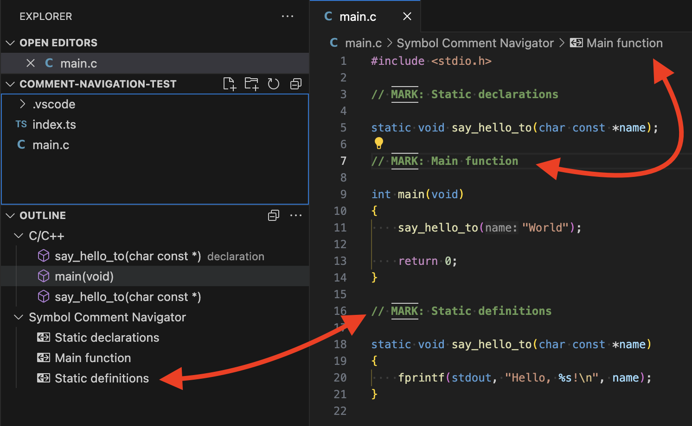
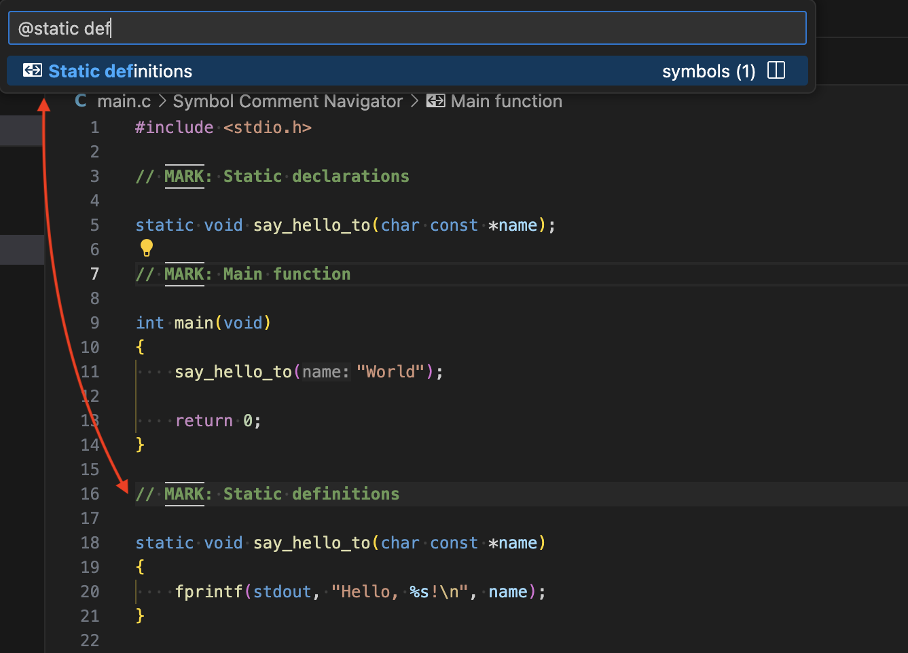
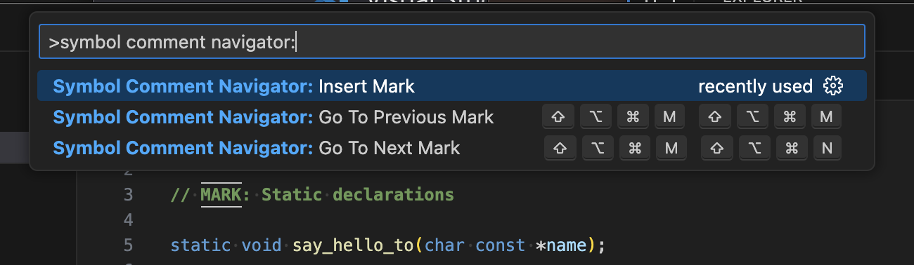
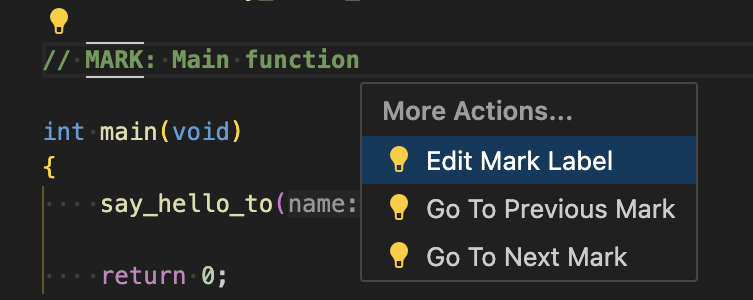
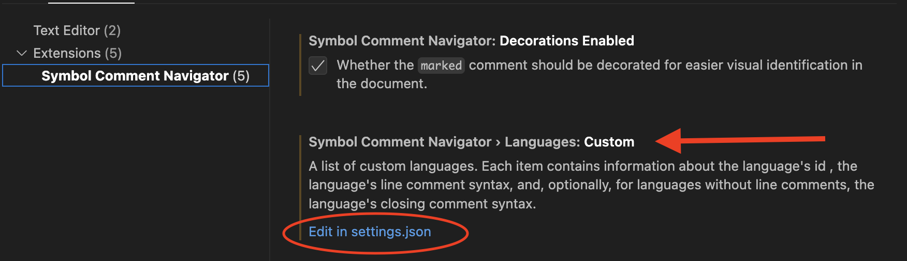
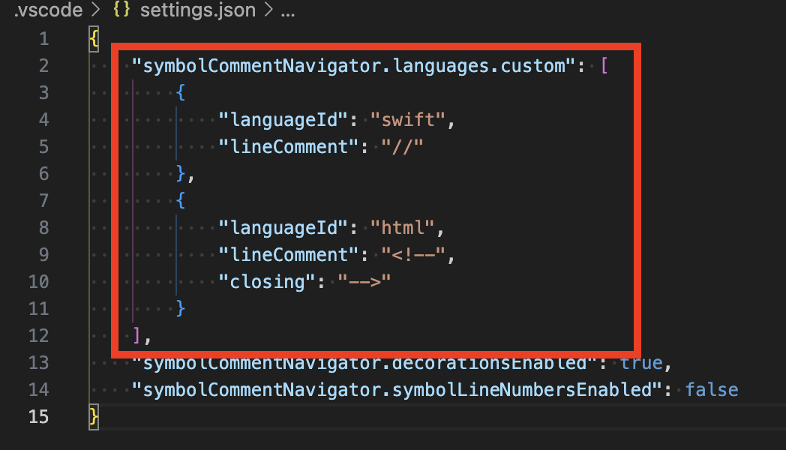

# Symbol Comment Navigator

A simple [VSCode](https://code.visualstudio.com/) extension that allows navigating **marked** comments as if they were code symbols, similar to Xcode's `// MARK:` syntax.

## A quick preview

    

## Features

This simple extension allows you to use line comments prefixed with a specific mark (e.g. `// MARK: My symbol name`) to turn that comment into a navigable symbol, which, as illustrated by [Figure 1](#figure-1) and [Figure 2](#figure-2), will then appear in the breadcrumbs section, in the document outline, as well as in the command pallette (when typing `@`).

    
    
Figure 1: Symbol comment in breadcrumbs and document outline.

    
    
Figure 2: Searching for a symbol comment using the command palette.

### Commands

The extension also contributes the following (also shown in [Figure 3](#figure-3)) three simple commands:

* `Insert Mark`: Will insert a symbol comment a the cursor's current position, with a placeholder for the symbol name. **NOTE:** Obviously, one could easily do away with this command an simply write `// MARK: Symbol name` manually, but the real advantage of the command over typing is that the former can be bound to special keys (i.e., keyboard shortcut).
* `Go To Previous Mark`: Will move the cursor to the previous symbol comment, relative to the cursor's current position.
* `Go To Next Mark`: Will move the cursor to the next symbol comment, relative to the cursor's current position.

    
    
Figure 3: Command palette showing contributed commands.

### Code actions

The `Go To Previous Mark` and `Go To Next Mark` commands listed [above](#commands) can also be triggered through "code actions" (see [Figure 4](#figure-4)). There is also a code action named `Edit Mark Label`, which will conveniently allow the user to edit the symbol name using an input box (not that directly modifying the comment inline is a difficult task, however).

    
    
Figure 4: Code actions associated with a symbol comment.

## Supported languages

Technically, this extension can be used with any languages. The extension does come with support for a few popular languages (see the [list below](#native-languages)), but it is very easy to [add support for a new language](#adding-a-new-language) using the extension's settings interface.

### Native languages

* TypeScript
* C
* C++
* C#
* Java
* Go
* JavaScript
* TypeScript
* PHP
* Python
* Rust
* Shell scripts
* HTML
* XML
* CSS

### Adding a new language

Support for a new language can be added by modifying either the **user** or the **workspace** settings, using the `symbolCommentNavigator.languages.custom` property, which latter corresponds to an array of items with the following properties: `languageId: string`, `lineComment: string`, and `closing?: string`. Note that the `closing` property is optional and should only be provided for languages that don't support "line comments" (e.g., HTML). [Figure 5](#figure-5) and [Figure 6](#figure-6) illustrate how to add support for both **Swift** and **HTML** (even though support for HTML is already provided by the extension). It should be noted that a custom language (i.e., a user-provided language) will override a native language when both use the same language ID.

    
    
Figure 5: How to add support for a new language (main settings view)

    
    
Figure 6: How to add support for a new language (JSON settings)

## Extension settings

This extension contributes the following settings:

* `symbolCommentNavigator.mark`: The `mark`, which defaults to `MARK`, used to determine if the line comment is to be treated as a symbol (which allows for comment navigation). For instance, `MARK` will be used as `// MARK: [symbol name here]` to navigate JavaScript code comments.
* `symbolCommentNavigator.decorationsEnabled`: Whether the **marked** comment should be decorated (i.e., styled) for easier visual identification in the document. The default is `true`.
* `symbolCommentNavigator.symbolLineNumbersEnabled`: Whether the line number should be included in the symbol's name. The default is `false`.
* `symbolCommentNavigator.languages.disabled`: A list of language IDs for which to disable symbol comments.
* `symbolCommentNavigator.languages.custom`: A list of custom languages. Each item contains information about the language's ID, the language's line comment syntax, and, optionally, for a language without line comments, the language's closing comment syntax. See [Figure 6](#figure-6) for an example.

## Pros and cons, things to note, and known limitations

* This extension uses the [start up activation event](https://code.visualstudio.com/api/references/activation-events#Start-up) (i.e., `"activationEvents": ["*"]`; see [package.json](./package.json#L37)) for its activation. This means that, when enabled, the extension will be activated right away for a workspace. Using language-specific activation events here is not sufficient, because we don't know about all languages in advance (i.e., the extension comes with a handful of supported languages, but most languages will be added by the user). That being said, users concerned by that could disable the extension globally, and only enable it on a "per workspace basic", where it is needed.
* This application implements the [DocumentSymbolProvider](https://code.visualstudio.com/api/references/vscode-api#DocumentSymbolProvider) interface in order to provide support for symbol comments navigation. The [SymbolInformation](https://code.visualstudio.com/api/references/vscode-api#SymbolInformation) objects it generates need to specify a [SymbolKind](https://code.visualstudio.com/api/references/vscode-api#SymbolKind). Since we are dealing with comments, which technically aren't code, the most appropriate type I was able to find in that enumeration was `Null`.
* **DISCLAIMER:** This is the first version of this extension, and it still needs testing. It might contain code sections that are not optimal. So please [let me know](#contact) if you find anything wrong that needs fixing.

## Contact

If you have any questions, if you find bugs, or if you have suggestions for this project, please feel free to contact me by opening an issue on the [repository](https://github.com/BB-301/vscode-extension-symbol-comment-navigator/issues).

## License

This project is released under an [MIT License with Commons Clause](./LICENSE).

## Copyright

Copyright (c) 2024 BB-301 (fw3dg3@gmail.com)

## Release Notes

### 0.1.0

Initial release